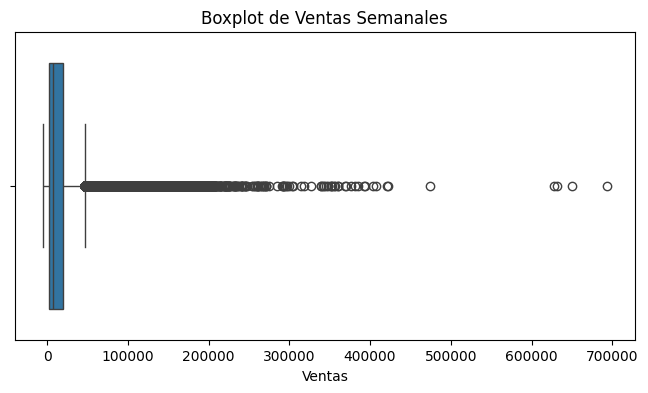
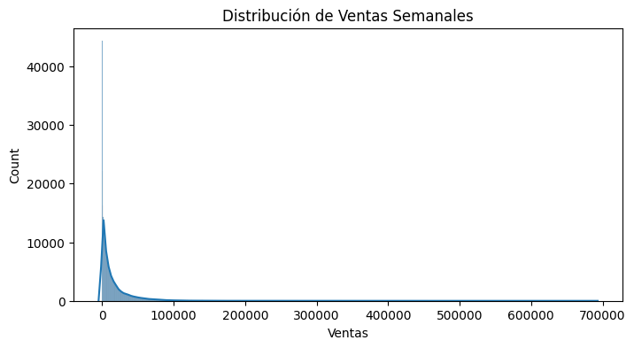
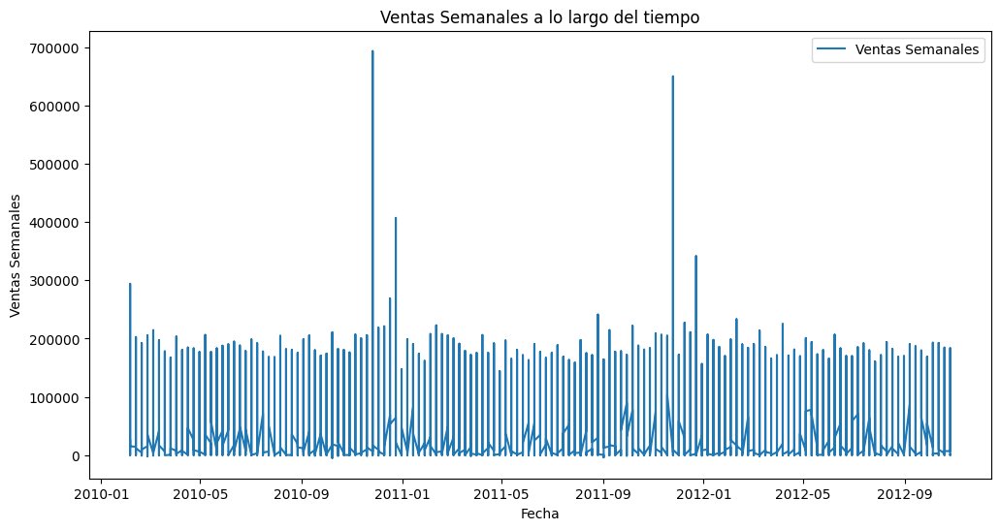

# reto-IM_ML

## Descripción del Proyecto

Este proyecto tiene como objetivo predecir las ventas semanales de diferentes tiendas y departamentos. Para ello se realiza un proceso de:

1. Análisis Exploratorio de Datos (EDA) para conocer la distribución y los patrones temporales de las ventas.
2. Preprocesamiento de datos para limpiar y transformar las variables.
3. Ingeniería de características (variables de fecha, lags, medias móviles, codificación de variables categóricas).
4. Entrenamiento y validación de un modelo de Machine Learning (por ejemplo, Random Forest).
5. Predicción final sobre un conjunto de datos de prueba sin ventas.

## Estructura de Archivos

- `train.csv`: Dataset de entrenamiento con columnas `Store`, `Dept`, `Date`, `Weekly_Sales`, `IsHoliday`.
- `test.csv`: Dataset de prueba sin la columna `Weekly_Sales` (para predecir).
- `main.py`: Archivo principal con el flujo de procesamiento y modelado.
- `requirements.txt`: Lista de librerías necesarias para ejecutar el proyecto.
- `README.md`: Este archivo de documentación.

## Pasos para Ejecutar el Código

1. Clonar el repositorio o descargar los archivos del proyecto.

2. Crear un entorno virtual (opcional pero recomendado):

    ```bash
    python -m venv venv
    ```

    En Windows:

    ```bash
    venv\Scripts\activate
    ```

    En macOS/Linux:

    ```bash
    source venv/bin/activate
    ```

3. Instalar los requisitos:

    ```bash
    pip install -r requirements.txt
    ```

4. Ejecutar el archivo principal (por ejemplo, `main.py`):

    ```bash
    python main.py
    ```

    Esto cargará los datasets `train.csv` y `test.csv`, realizará el preprocesamiento, entrenará el modelo y generará las predicciones finales.

## Resultados

- El código mostrará las métricas de validación (MAE).

## requirements.txt

A continuación se muestra un ejemplo de las librerías requeridas con versiones aproximadas. Puedes ajustar las versiones según tu entorno o necesidades específicas:

```ini
matplotlib==3.10.0
numpy==2.2.3
pandas==2.2.3
scikit-learn==1.6.1
seaborn==0.13.2
```

Instalación:

```bash
pip install -r requirements.txt
```

## Análisis de las Gráficas

1. Boxplot de Ventas Semanales

    

    **Observación principal:** Se aprecia una gran concentración de valores en la zona baja, con un rango intercuartil relativamente estrecho. Sin embargo, hay muchos puntos (outliers) que se extienden hasta valores muy altos, llegando incluso a superar las 600,000 unidades.

    **Interpretación:** La distribución de ventas es altamente asimétrica (skewed). Esto indica que, aunque la mayoría de las tiendas/departamentos tienen ventas “típicas” dentro de un rango moderado, existen algunos casos con ventas excepcionalmente altas que pueden corresponder a eventos específicos, tiendas de mayor tamaño o temporadas muy puntuales.

2. Distribución de Ventas Semanales (Histograma + KDE)

    

    **Observación principal:** La mayoría de las observaciones se encuentran en valores de ventas relativamente bajos (cerca de 0 a 20,000), mientras que el resto se extiende en una cola muy larga hacia la derecha.

    **Interpretación:** La distribución es fuertemente asimétrica con una cola a la derecha (right-skewed). Este tipo de distribución puede hacer que métricas como la media sean menos representativas que la mediana. Además, para modelos predictivos, puede ser útil probar transformaciones como logaritmos para atenuar el impacto de los valores muy altos.

3. Serie Temporal de Ventas Semanales a lo largo del tiempo

    

    **Observación principal:** A lo largo de los años (2010, 2011 y 2012) se observan varios picos muy pronunciados. La mayoría de los valores se sitúa en un rango entre 0 y 100,000, pero en ciertas fechas se superan con creces los 300,000 e incluso los 600,000.

    **Posibles causas:**

    - Fechas de promociones o festivos: Podrían corresponder a eventos como el Black Friday, Navidad o promociones especiales.
    - Estacionalidad: Es posible que durante ciertas épocas del año (por ejemplo, verano o periodos festivos) las ventas suban de forma notable.
    - Cambios de inventario o estrategias de marketing: Las subidas repentinas pueden indicar eventos puntuales.

    **Interpretación:** El patrón general muestra fluctuaciones semanales, picos estacionales y un alto número de outliers. Para capturar estos comportamientos en el modelado, es fundamental:

    - Incluir variables de fecha (mes, semana, año).
    - Incluir indicadores de festivos o promociones (IsHoliday, etc.).
    - Manejar adecuadamente los valores extremos (outliers).

## Conclusión

Las gráficas confirman que los datos de ventas presentan una alta variabilidad y una marcada asimetría, con outliers que podrían afectar al entrenamiento de los modelos. Es recomendable llevar a cabo un adecuado preprocesamiento (limpieza, transformaciones y manejo de outliers) y una ingeniería de características que considere la estacionalidad y los eventos especiales para mejorar la capacidad predictiva del modelo.

## Resultados

- **MAE (Error Absoluto Medio):** 1,333


## Análisis

- **MAE:** El MAE de 1,333 indica que, en promedio, el modelo se equivoca en aproximadamente 1,333 unidades en las predicciones de ventas.
- **Error Relativo:** Dado que la media de ventas es de aproximadamente 16,000, el error relativo del modelo es de aproximadamente 8%, lo cual es aceptable pero podría mejorarse.


## Posibles Mejoras en el Modelo

### Transformación Logarítmica de la Variable Objetivo

Dado que las ventas tienen una distribución altamente sesgada con una larga cola a la derecha, aplicar `log(Weekly_Sales + 1)` podría hacer que los valores sean más manejables y mejorar la capacidad del modelo para predecir rangos más altos de ventas con precisión.

### Manejo de Outliers

- **Filtrar o atenuar outliers extremos
- **Sustituir valores extremos


